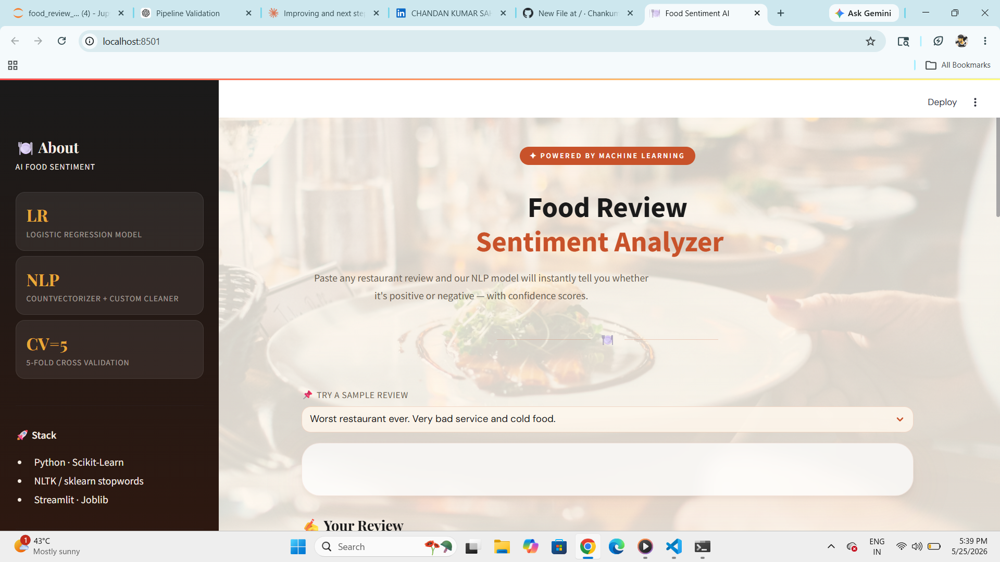
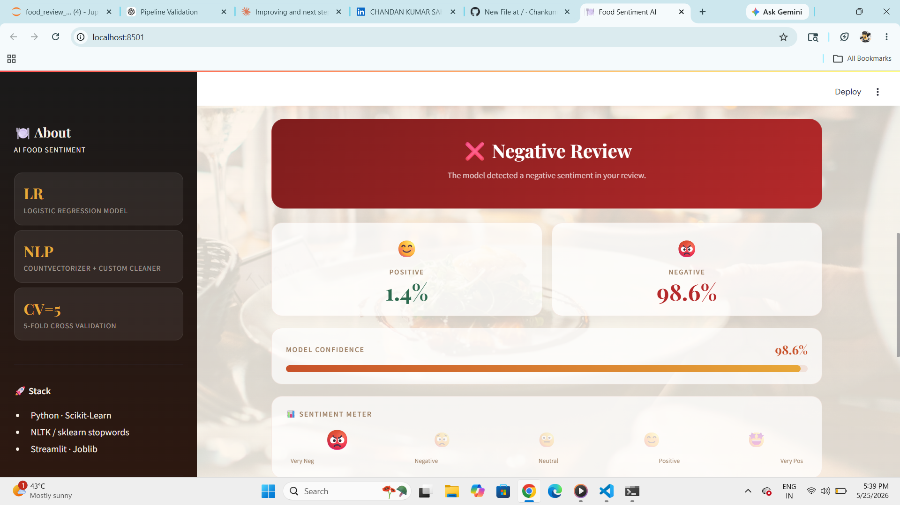
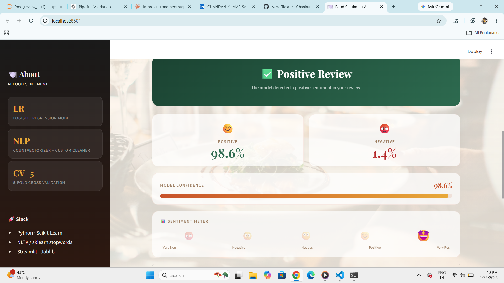

# 🍽️ Food Review Sentiment Analyzer | NLP + Streamlit


🚀 End-to-End Machine Learning Web Application  
From Data Cleaning → NLP → Model Training → Streamlit Deployment

---

## 📌 Project Overview

This project presents an interactive **Food Review Sentiment Analyzer** built using Streamlit and Scikit-Learn to analyze:

- Positive vs Negative Sentiment Detection
- Confidence Score & Probability Breakdown
- Real-time NLP Text Processing
- Prediction History Tracking

👉 Goal: Enable **instant sentiment analysis** of food & restaurant reviews using Machine Learning.

---

## ⭐ Key Highlights

- Built a **complete NLP pipeline** with CountVectorizer + Logistic Regression
- Created **custom text cleaning** preserving `not` and `no` for sentiment accuracy
- Designed a **professional Streamlit UI** with food-themed background
- Added **emoji sentiment meter** from 😡 Very Negative to 🤩 Very Positive
- Delivered **real-time predictions** with probability scores and confidence bar

---

## 🎯 Business Problem

Restaurant owners and food platforms face challenges such as:

- Manual review of thousands of customer feedbacks
- No automated way to detect customer satisfaction
- Difficulty identifying negative experiences quickly

👉 **Key Question:**  
How to automatically classify food reviews as positive or negative with high accuracy?

---

## 🛠 Tech Stack

- Python
- Streamlit
- Scikit-Learn
- NLP (CountVectorizer + Custom Text Cleaning)
- Logistic Regression
- Joblib
- Pandas

---

## 🤖 Model Details

### 🔹 ML Pipeline
- CountVectorizer (preprocessor = text_cleaning)
- Logistic Regression

### 🔹 Text Cleaning Steps
1. Convert to lowercase
2. Remove stopwords (keeping `not` and `no`)
3. Strip non-alphabetic characters

### 🔹 Validation
- 5-Fold Cross Validation
- Output: Binary (1 = Positive, 0 = Negative)

---

## 🔄 Project Pipeline

1. Data Collection
2. Text Cleaning & Preprocessing
3. CountVectorizer (Bag of Words)
4. Logistic Regression Model Training
5. 5-Fold Cross Validation
6. Model Serialization (Joblib)
7. Streamlit App Development
8. Deployment

---

## 📊 App Features

### 📌 Main Features
- 🔍 Instant Sentiment Detection (Positive / Negative)
- 📊 Confidence Score with visual gradient bar
- 😊 Emoji Sentiment Meter
- 📈 Positive & Negative Probability Cards
- 📌 Sample Reviews dropdown
- 🧹 Cleaned Text Preview (expander)
- 🕘 Prediction History Table
- 📝 Live Character Counter (500 limit)

---

## 📸 App Preview

### 🏠 Home — Enter Your Review


### ❌ Negative Review Result


### ✅ Positive Review Result


---

## 📁 Project Structure

```
Food-Review-Sentiment-Analyzer/
│
├── app.py                         # Main Streamlit application
├── food_review_sentiment.pkl      # Trained ML pipeline
├── requirements.txt               # Python dependencies
├── food_1.png                     # App screenshot 1
├── food_2.png                     # App screenshot 2
├── food_3.png                     # App screenshot 3
└── README.md                      # Project documentation
```

---

## ⚙️ How to Run Locally

1. Clone the repository
```bash
git clone https://github.com/ChankumarSah/Food-Review-Sentiment-Analyzer.git
cd Food-Review-Sentiment-Analyzer
```

2. Install dependencies
```bash
pip install -r requirements.txt
```

3. Run the app
```bash
streamlit run app.py
```

4. Open in browser
```
http://localhost:8501
```

---

## 📦 Requirements

```
streamlit
scikit-learn
pandas
joblib
```

---

## 💡 How It Works

```
User Input (Raw Review)
        ↓
  Streamlit UI (app.py)
        ↓
  ML Pipeline (.pkl)
        ↓
  CountVectorizer (preprocessor = text_cleaning)
        ↓
  Logistic Regression Model
        ↓
  Prediction + Probability Score
        ↓
  Result Displayed (Positive / Negative + Confidence %)
```

---

## 📈 Key Insights

- Logistic Regression performs well on short text classification
- Keeping `not` and `no` in stopwords improves negative review detection
- CountVectorizer with custom preprocessor gives clean and accurate features
- 5-Fold CV ensures model is not overfitting

---

## 💡 Recommendations / Future Improvements

- Add VADER or BERT for deeper sentiment analysis
- Deploy on Streamlit Cloud for public access
- Add multi-language support
- Integrate with Google Reviews API

---

## ▶️ How to Use

1. Open the app
2. Select a sample review or type your own
3. Click **Analyse Sentiment**
4. View result, confidence score, and sentiment meter
5. Check prediction history below

---

## 🎯 Project Impact

✔ End-to-end NLP + ML solution  
✔ Real-time sentiment classification  
✔ Clean and professional UI  
✔ Reusable pipeline for any text classification task  

---

## 👨‍💻 Author

**Chandan Kumar Sah**  
Data Analyst | Python • Machine Learning • NLP • Power BI  
📧 irisblack0503@gmail.com  
🔗 [LinkedIn](https://www.linkedin.com/in/chandan-kumar-sah-752803387)  
💻 [GitHub](https://github.com/ChankumarSah)  

---

## ⭐ Support

If you like this project:  
⭐ Star this repo  
🤝 Connect on LinkedIn for collaboration  

---
